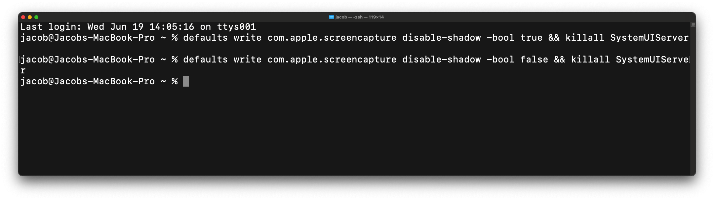
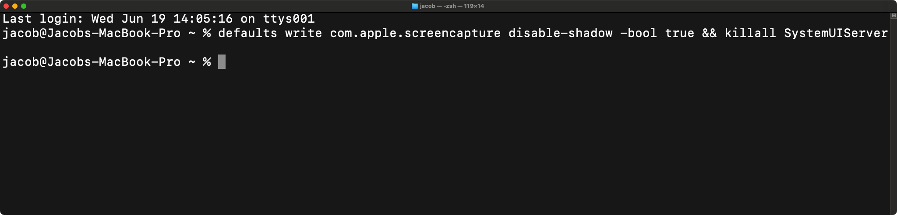

# macOS Screenshot Shadow Tool
macOS Screenshot Shadow Tool — enable or disable the shadow border and transparency in screenshots that are added when taking a screenshot of a window.

## How to enable or disable
### Disabling
<ol>
  <li>Open Terminal.
    <ul>
      <li>Open Launchpad or press F4 on your Apple keyboard, go to the Other folder and look for Terminal.</li>
      <li>Open Launchpad or press F4 on your Apple keyboard and search "Terminal".</li>
      <li>Press ⌘/⊞ + Space and search "Terminal".</li>
    </ul>
  <li>
    Copy the command below and paste it into the Terminal app. 
    
    defaults write com.apple.screencapture disable-shadow -bool true && killall SystemUIServer
    
  </li>
  <li>Press Enter and the shadow and the transparency are gone!</li>
</ol>

### Enabling
<ol>
  <li>Open Terminal.
    <ul>
      <li>Open Launchpad or press F4 on your Apple keyboard, go to the Other folder and look for Terminal.</li>
      <li>Open Launchpad or press F4 on your Apple keyboard and search "Terminal".</li>
      <li>Press ⌘/⊞ + Space and search "Terminal".</li>
    </ul>
  <li>
    Copy the command below and paste it into the Terminal app. 
    
    defaults write com.apple.screencapture disable-shadow -bool false && killall SystemUIServer
    
  </li>
  <li>Press Enter and the shadow and the transparency are back!</li>
</ol>

No sudo command is required!

## Screenshots
**Enabled**   <kbd></kbd>   
**Disabled**   <kbd></kbd>

 
